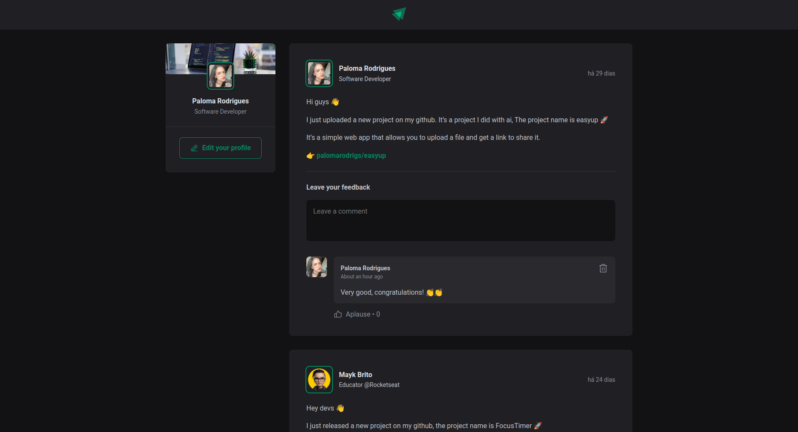

# Ignite - Feed

An app for adding, deleting, and liking comments. Users can post new comments, remove and like others comments.

## 🔨 Features

- [x] Add new comment
- [x] Delete comment
- [x] Add like to comment

## 🧪 Tools

- [React](https://react.dev/)
- [Vite](https://vitejs.dev/)
- [TypeScript](https://www.typescriptlang.org/)

## 🚀 Deploy

You can access the project through [this link](https://ignite-feed-foundations.vercel.app/)

---

Developed with 💜 by <a href="https://www.linkedin.com/in/palomarodrigs" target="_blank">Paloma Rodrigues</a>

